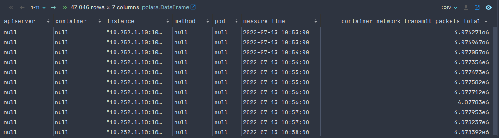

# Erkenntnisse

### Zeitstempel

Prometheus sammelt in regelmäßigen Abständen seine Metriken. Gegenübergestellt zeichnet Jaeger Traces auf, welche zum
einen sehr lang und umfangreich, aber auch nur ganz kurz sein können. Deswegen kann es passieren, dass ein Jaeger Trace
zwischen die Messzeitpunkte von Prometheus fällt. Generell wird es nicht häufig passieren, dass sich diese Zeitstempel
perfekt überschneiden. Deswegen müssen die Zeitstempel gerundent, oder mittels asof-join gejoint werden. Falls die
exportierten Daten in einem ganz anderen Zeitfenster liegen, erhält man logischerweise keine Ergebnisse.

### Container, Service, Pod

Prometheus bringt bei seinen Metriken viele verschiedene Labels mit:

* container
* endpoint
* job
* namespace
* node
* pod
* service

Jaeger auch:

* servicename
* hostname
* ip
* component

Welche Labels was bedeuten kann stark von der Konfiguration abhängen. Hierbei wurde der hostname und der pod verglichen.

### Container = 'POD' oder null

In vielen Prometheus-Einträgen (oder meist genau 50 Prozent) findet man den Container namens "POD". Dabei handelt es
sich bei dem 'POD' Containern um sogenannte 'pause' Container. Dieser ist sozusagen der 'parent' Container, welcher
anderen Containern den Linux-Namespace teilt, etc. Mehr
dazu [hier](https://www.ianlewis.org/en/almighty-pause-container). Jedoch sind diese Daten meist nicht relevant,
deswegen wurden diese gefiltert.

### Duplicate Traces

Da ein Trace mehrere Services überspannen kann, sind diese Traces auch mehrfach vorhanden in den jeweiligen Exports
dieses Services. Diese müssen gefiltert werden. Sprich die Daten machen einen größeren Anschein als sie es wirklich
sind.

### Format der Metriken

Ein sehr großes Problem war das Format der Metriken. Prometheus zeichnet diese so auf:

| __name__        | values                          | container | ... |
|-----------------|---------------------------------|-----------|-----|
| cpu_usage_total | [[1, 1], [2, 1], [3, 1], ...]   | abcd1234  | ... |
| cpu_usage_total | [[1, 1], [2, 1.5], [3, 1], ...] | efgh5678  | ... |

Am Ende möchte aber ein Format vorliegen haben, in welchem die Daten als Spalte angesehen werden:

| container | measure_time | cpu_usage_total | ... |
|-----------|--------------|-----------------|-----|
| abcd1234  | 1            | 1               | ... |
| abcd1234  | 2            | 1               | ... |
| abcd1234  | 3            | 1               | ... |
| efgh5678  | 1            | 1               | ... |
| efgh5678  | 2            | 1.5             | ... |
| efgh5678  | 3            | 1               | ... |

### Datenüberschneidung

Manche Daten überschneiden merklich besser als andere, nicht nur weil mehr Daten vorliegen. Manche überschneiden zB.
überhaupt nicht. Im Service ts-admin-basic-info-service existieren über 2400 Metriken in großen Mengen. Hier kann auch
zu jeder Metrik ein Eintrag gefunden werden und gejoint werden. Im ts-auth-mongo-4.4.15 existiert zB nur die
Überschneidung zu container_memory_working_set_bytes und container_cpu_usage_seconds_total. Bei genauerer Inspektion
liegt jedoch auch eine 22 MB große Datei für die Metrik container_network_transmit_packets_total vor. Bei dieser ergibt
sich kein einziges Ergebnis, was mich ein bisschen stutzig macht.

Diese Datei wurde sich angesehen und aus den 645817 Einträgen sind:

* 47046 null
* 598771 mit dem Container "POD"

Diese beiden Zahlen zusammengerechnet: 645817

Falls nur der Container null ist und der Pod nicht, können diese noch weiterverarbeitet werden, aber in folgendem
Screenshot sieht man, dass das nicht funktionieren wird:

### Zahlen und Fakten:

| Service                                                             | Monitoringdaten | Tracingdaten | # Spalten | # Zeilen |
|---------------------------------------------------------------------|-----------------|--------------|-----------|----------|
| ts-auth-mongo_5.0.9_2022-07-06                                      | 51.205784MB     | 0.17561MB    | 10        | 37       |
| ts-auth-mongo_4.4.15_2022-07-13                                     | 49.291915MB     | 3.702373MB   | 14        | 377      |
| ts-order-service_3.0.4-mongodb-driver_2022-07-13                    | 48.1162MB       | 24.866914MB  | 14        | 397      |
| ts-order-service_mongodb_4.2.2_2022-07-12                           | 48.076004MB     | 45.314627MB  | 14        | 1283     |
| ts-admin-basic-info-service-sprintstarterweb_1.5.22                 | 1733.028127MB   | 33.190224MB  | 61        | 976      |
| ts-order-service_2.7.1-SpringBootStarterParent_2022-07-11           | 54.617123MB     | 37.246728MB  | 16        | 2876     |
| ts-order-service_springstarterdataMongoDB_1.5.22.RELEASE_2022-07-11 | 54.76274MB      | 84.725155MB  | 16        | 2643     |
| ts-order-service_springstarterdataMongoDB_2.0.0.RELEASE_2022-07-11  | 54.803428MB     | 30.214909MB  | 16        | 1455     |
| ts-order-service_mongodb_4.4.15_2022-07-12                          | 49.008528MB     | 20.715173MB  | 14        | 1304     |

Dabei hat das Datenset 10 Spalten, falls kein einziger Join durchgeführt werden kann. 16 Spalten sind 4 Metriken, welche
gejoint werden konnten.

Die Korrelationsmatrix (Pearson), die dabei ensteht ist folgende:

|            | monitoring | tracing | col    | row    |
|------------|------------|---------|--------|--------|
| monitoring | 1          | 0.033   | 0.993  | -0.105 |
| tracing    | 0.033      | 1       | 0.108  | 0.771  |
| col        | 0.993      | 0.108   | 1      | -0.017 |
| rows       | -0.105     | 0.771   | -0.017 | 1      |

 
